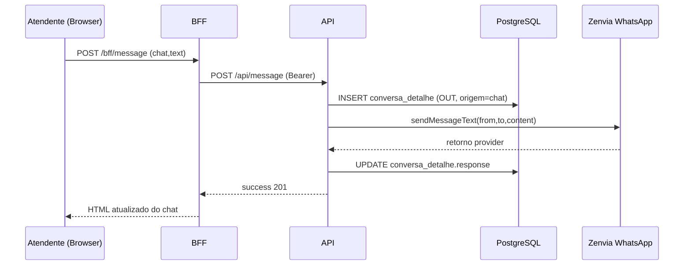

# Funcionalidades: Envio de Mensagens

## Objetivo
Este documento explica, com base no código atual do projeto, como uma mensagem é enviada no chat (texto, anexo/áudio e mensagens automáticas), desde o frontend até a persistência em banco e envio para WhatsApp via Zenvia.

## Visão Geral da Arquitetura
- Frontend (browser): `src/public/js/chat/*.js` + views Pug (`src/views/bff/*`)
- BFF: rotas em `src/routes/bff.js` e controllers `src/modules/front/controllers/*`
- API interna: rotas em `src/routes/api.js` e controllers `src/modules/api/controllers/*`
- Persistência: model `conversa_detalhe` (`src/models/ChatDetails.js`)
- Provedor WhatsApp: `src/services/zenvia.js`
- Anexos: integração Tdocs `src/services/telecontrol/tdocs.js`

---

## 1. Fluxo Principal: Envio de Texto (Atendente -> Cliente)

### 1.1 Origem no Frontend
Na tela de chat (`src/views/bff/user_chat.pug`):
- Formulário `form#chatinput-form` contém:
  - `chat` (hidden)
  - `text` (textarea `#chat-input`)
- Botão de envio chama: `window.chatInstance.chatMessage.sendMessage();`

Implementação: `src/public/js/chat/message.js` (`sendMessage`)
- Lê `#chat-input`
- Serializa formulário e adiciona `firstrequest=true`
- Monta objeto socket: `{ chat, text, sendMessage: true }`
- Se socket estiver saudável, envia por evento `listenMessage`
- Se socket não estiver saudável, faz `POST /bff/message` (fallback HTTP)

### 1.2 Rota BFF
Rota: `POST /bff/message` em `src/routes/bff.js`
- Controller: `src/modules/front/controllers/MessageController.js` (`createMessage`)
- Chama service: `sendMessage(req, oldData)` em `src/modules/services/message.js`

### 1.3 Service BFF de Mensagem
Arquivo: `src/modules/services/message.js`
- `sendMessage(req, data)`:
  - Obtém instância de socket da sessão (`req.session.socketId`)
  - Registra listener `listenMessage` para enviar/marcar leitura
  - Se `firstrequest === 'true'`, chama `initializeCreateMessage(req, data)`
- `initializeCreateMessage` chama `MessageController.createMessageInstance` (API controller usado internamente)

### 1.4 Criação e Envio na API
Arquivo: `src/modules/api/controllers/MessageController.js` (`createMessage` / `createMessageInstance`)

Passos:
1. Valida payload (`chat` UUID válido e `text` obrigatório) via `messageValidationRules`.
2. Busca telefones de origem/destino com `ChatDetailsRepository.findSenderAndRecipientPhones(chat)`:
   - `de` (chatbot): telefone da fábrica/cliente (`Client.fone`)
   - `para` (usuário): `Chat.campos_extras.celular_cliente`
3. Prefixa texto com nome do atendente (se existir no token):
   - Formato: `*Nome Atendente:* mensagem`
4. Cria registro em `conversa_detalhe` com:
   - `direction: OUT`
   - `origem: chat`
   - `contents: [TextContent]`
5. Envia para WhatsApp via `ZenviaService.sendMessageText(de, para, content)`
6. Salva resposta da Zenvia no campo `response`
7. Retorna `success(..., 201)`

### 1.5 Resposta para Tela
No BFF (`front MessageController.createMessage`):
- Rebusca o chat completo (`chatMessages`)
- Formata mensagens (`formatMessages`)
- Agrupa por data/timezone
- Renderiza Pug: `bff/user_chat`

---

## 2. Exemplo de Payloads

### 2.1 Front -> BFF (`/bff/message`)
`application/x-www-form-urlencoded`:

```txt
chat=9f9c4f5f-....&text=Ol%C3%A1%2C+preciso+de+ajuda&firstrequest=true
```

### 2.2 BFF -> API (`/api/message`)
JSON interno (com Bearer token):

```json
{
  "chat": "9f9c4f5f-....",
  "text": "Olá, preciso de ajuda"
}
```

### 2.3 Estrutura gravada em `conversa_detalhe` (OUT)

```json
{
  "conversa_id": "9f9c4f5f-....",
  "direction": "OUT",
  "origem": "chat",
  "de": "5511XXXXXXXX",
  "para": "55DDDNUMEROCLIENTE",
  "contents": [
    { "type": "text", "text": "*Atendente:* Olá, preciso de ajuda" }
  ],
  "response": { "...": "retorno zenvia" }
}
```

---

## 3. Fluxo de Anexos e Áudio

### 3.1 Frontend
Arquivos:
- `src/public/js/chat/file.js`
- `src/public/js/chat/audio.js`

Fluxo:
1. Front cria bloco temporário (`/bff/temporary-file` ou `/bff/temporary-audio`)
2. Envia arquivo real para `POST /bff/message-file` (multipart)

### 3.2 Validação de arquivo (BFF)
`messageFileValidationRules` valida:
- chat válido
- tipo MIME permitido
- tamanho máximo por categoria (documento/imagem/vídeo/áudio)

### 3.3 Processamento API
`src/modules/api/controllers/MessageController.js` (`createMessageFile`):
1. Recebe `file` em base64 + `filename` + `mimetype`
2. Sobe arquivo para Tdocs (`TelecontrolTdocsApiClient.postDocument`)
3. Cria `FileContent`
4. Salva em `conversa_detalhe` com:
   - `direction: OUT`
   - `origem: chat_anexo`
   - `campos_extras` com metadados do arquivo (nome original, normalizado, unique_id)
5. Envia para WhatsApp via Zenvia
6. Salva `response`

### 3.4 Renderização posterior
`formatMessages` prioriza URL do Tdocs e mantém fallback para URL original (Zenvia) em caso de erro de carregamento.

---

## 4. Status de Entrega (SENT/DELIVERED/READ)

- Consulta status em `conversa_detalhe_status` via `ChatDetailsRepository.getMessagesDeliveryStatus`
- `GET /api/chat/:id_chat` faz merge de `delivery_status` em cada mensagem
- Front usa ícones no template `bloco_message.pug`:
  - `SENT` -> 1 check
  - `DELIVERED` -> 2 checks
  - `READ` -> 2 checks azuis

Também existe endpoint dedicado:
- `GET /api/chat/messages-delivery-status/:id_chat`
- BFF equivalente: `GET /bff/chat/messages-delivery-status/:chat`

---

## 5. Mensagens Automáticas (Também usam o mesmo padrão de envio)

Arquivo central: `src/classes/ChatService.js`

Métodos que enviam mensagem OUT e salvam em `conversa_detalhe`:
- `sendWelcomeMessage` (abertura)
- `sendTransferMessage` (transferência)
- `sendFinalizedMessage` (finalização manual)
- `sendAutoFinalizedMessage` (finalização automática)
- `sendUnavailableMessage`
- `sendLgpdConsentMessage` / `sendLgpdConsentMessageWithButtons`
- `sendMessageText` (usado em NPS)

Gatilhos principais em `src/modules/api/controllers/ChatController.js`:
- `openChat` -> boas-vindas (se config habilitada)
- `transferChat` -> transferência (se config habilitada)
- `finalizeChat` -> finalização (se config habilitada)
- `autoFinalizeChat` -> finalização automática (se config habilitada)
- `sendActiveSurvey` -> envio NPS (mensagem inicial + primeira pergunta)

---

## 6. Socket e Fallback HTTP

Conexão de socket:
- Front: `src/public/js/socket.js` cria conexão Socket.IO (polling)
- Registra `socketId` no backend: `POST /bff/auth/socketId`
- Backend guarda mapeamento `socketId -> userId` e `req.session.socketId`

Envio de mensagem:
- Preferência: evento socket `listenMessage`
- Fallback: `POST /bff/message`

Objetivo do fallback:
- Manter envio funcional quando socket estiver indisponível/desabilitado/instável.

---

## 7. Endpoints Relacionados

- `POST /bff/message` -> enviar texto
- `POST /api/message` -> enviar texto (API)
- `POST /bff/message-file` -> enviar anexo/áudio
- `POST /api/message-file` -> enviar anexo/áudio (API)
- `PUT /api/message/read/:id` -> marcar como lida
- `PUT /api/message/lgpd-consent` -> enviar consentimento LGPD
- `GET /api/chat/:id_chat` -> carrega chat + detalhes + delivery_status
- `GET /api/chat/messages-delivery-status/:id_chat` -> status de entrega

---

## 8. Regras e Validações Importantes

- Texto:
  - `chat` deve existir para o cliente logado
  - `text` não pode ser vazio
- Arquivo:
  - MIME permitido
  - limite por tipo
- Envio sempre cria `conversa_detalhe` antes de chamar Zenvia
- Em caso de erro da Zenvia, resposta fica sem confirmação de entrega e o front trata erro/estado temporário

---

## 9. Sequência Resumida (Texto)



---

## 10. Checklist de Teste Rápido

1. Abrir um chat em atendimento.
2. Enviar texto simples e confirmar:
   - mensagem aparece com prefixo do atendente
   - registro novo em `conversa_detalhe` com `direction=OUT` e `origem=chat`
3. Enviar anexo e confirmar:
   - registro com `origem=chat_anexo`
   - `campos_extras` com `unique_id` do Tdocs
4. Validar status de entrega no front (`SENT/DELIVERED/READ`).
5. Simular indisponibilidade de socket e validar fallback via HTTP.

---

## 11. Arquivos-Chave

- Rotas:
  - `src/routes/bff.js`
  - `src/routes/api.js`
- Controllers:
  - `src/modules/front/controllers/MessageController.js`
  - `src/modules/api/controllers/MessageController.js`
  - `src/modules/api/controllers/ChatController.js`
- Services:
  - `src/modules/services/message.js`
  - `src/services/zenvia.js`
  - `src/services/telecontrol/tdocs.js`
  - `src/classes/ChatService.js`
- Frontend:
  - `src/public/js/chat/message.js`
  - `src/public/js/chat/file.js`
  - `src/public/js/chat/audio.js`
  - `src/views/bff/user_chat.pug`
  - `src/views/bff/includes/user_chat/bloco_message.pug`


# Guia Completo: Implementar API de Envio de Mensagens com Zenvia em Outro Projeto

> Baseado no fluxo real documentado em `.docs/FUNCIONALIDADES-ENVIO-MENSAGENS.md` e no código atual deste projeto.

## 1. Objetivo deste guia
Este documento foi escrito para servir como especificacao de implementacao em outro projeto (Node.js ou stack equivalente), cobrindo:
- envio de mensagem de texto
- envio de anexo
- envio por template
- registro em banco
- tokens (single-tenant e multi-tenant)
- status de entrega (SENT, DELIVERED, READ)
- webhook de status
- erros, observabilidade e checklist de producao

A ideia e que, com este arquivo, voce consiga pedir ao Codex para implementar sem precisar redescobrir regras do negocio.

---

## 2. Como o projeto atual faz envio com Zenvia

## 2.1 Biblioteca e servico
- Dependencia principal: `@zenvia/sdk` (package.json)
- Wrapper local: `src/services/zenvia.js`

Metodos usados:
- `sendMessageText(from, to, contents)`
- `sendMessageTextWithButtons(from, to, contents)` (via endpoint REST da Zenvia)
- `sendTemplateMessage(from, to, contents)`
- `sendMessageWithToken(from, to, contents, zenviaToken)` (estatico, sem sessao)

## 2.2 Onde o token da Zenvia e obtido
No projeto atual, o token nao e fixo global por padrao; ele vem do cliente (tenant):
- campo: `cliente.campos_extras.zenviaToken`
- no login, entra no payload da sessao/JWT via `buildSignPayload` (`src/helpers/user.js`)
- depois e recuperado por `getZenviaToken(req.session.token)` (`src/helpers/token.js`)

## 2.3 Quem define `from` e `to`
No envio de mensagem de chat:
- `from` = telefone da operacao/fabrica (`cliente.fone`)
- `to` = telefone do cliente final (`conversa.campos_extras.celular_cliente`)

Fonte: `ChatDetailsRepository.findSenderAndRecipientPhones`.

## 2.4 Persistencia primeiro, envio depois
Padrao usado:
1. cria registro na tabela de mensagens (`conversa_detalhe`) com `direction='OUT'`
2. chama Zenvia
3. salva retorno no campo `response`

Esse padrao e importante para rastreabilidade e auditoria.

---

## 3. Decisoes arquiteturais para portar

## 3.1 Recomendacao de modulo
Crie um modulo dedicado, por exemplo:
- `modules/zenvia/zenvia.client.ts`
- `modules/messages/messages.controller.ts`
- `modules/messages/messages.service.ts`
- `modules/messages/messages.repository.ts`
- `modules/webhooks/zenvia.webhook.controller.ts`

## 3.2 Recomendacao de estrategias de token
Implemente as 2:

1. `single-tenant` (simples)
- usa `ZENVIA_TOKEN` em env
- bom para MVP

2. `multi-tenant` (producao)
- token por tenant no banco (ex: `tenants.extra.zenviaToken`)
- seleciona token por tenant da requisicao
- opcionalmente cacheia token em memoria/redis

No projeto atual, o modo usado e multi-tenant com token por cliente.

---

## 4. Modelo de dados minimo (portavel)

Abaixo, modelo minimo inspirado no projeto atual.

## 4.1 Tabela de tenant/cliente
```sql
CREATE TABLE tenants (
  id UUID PRIMARY KEY,
  name TEXT NOT NULL,
  whatsapp_sender_phone TEXT NOT NULL,
  extra JSONB NULL,
  created_at TIMESTAMP NULL
);

-- extra.zenviaToken = token da zenvia
```

## 4.2 Tabela de conversas
```sql
CREATE TABLE conversations (
  id UUID PRIMARY KEY,
  tenant_id UUID NOT NULL REFERENCES tenants(id),
  customer_phone TEXT NOT NULL,
  extra JSONB NULL,
  created_at TIMESTAMP NOT NULL DEFAULT NOW(),
  closed_at TIMESTAMP NULL
);
```

## 4.3 Tabela de mensagens (equivalente a `conversa_detalhe`)
```sql
CREATE TABLE conversation_messages (
  id UUID PRIMARY KEY,
  conversation_id UUID NOT NULL REFERENCES conversations(id),
  direction TEXT NOT NULL, -- IN | OUT
  origin TEXT NOT NULL,    -- chat | chat_anexo | webhook_anexo | integracao
  from_phone TEXT NOT NULL,
  to_phone TEXT NOT NULL,
  contents JSONB NOT NULL,
  request_payload JSONB NULL,
  provider_response JSONB NULL,
  extra JSONB NULL,
  read_flag BOOLEAN NOT NULL DEFAULT FALSE,
  notified_flag BOOLEAN NOT NULL DEFAULT FALSE,
  integrated_at TIMESTAMP NULL,
  created_at TIMESTAMP NOT NULL DEFAULT NOW()
);
```

## 4.4 Tabela de historico de status de entrega (equivalente a `conversa_detalhe_status`)
```sql
CREATE TABLE conversation_message_status (
  id UUID PRIMARY KEY,
  conversation_id UUID NULL,
  conversation_message_id UUID NOT NULL REFERENCES conversation_messages(id),
  extra JSONB NULL, -- extra.messageStatus.code = SENT|DELIVERED|READ
  created_at TIMESTAMP NOT NULL DEFAULT NOW()
);
```

## 4.5 Indices obrigatorios
```sql
CREATE INDEX idx_conv_messages_conversation_created
  ON conversation_messages(conversation_id, created_at);

CREATE INDEX idx_conv_messages_pending_read
  ON conversation_messages(conversation_id, read_flag, direction, origin);

CREATE INDEX idx_conv_msg_status_message
  ON conversation_message_status(conversation_message_id, created_at);

CREATE INDEX idx_conv_msg_status_code
  ON conversation_message_status((extra->'messageStatus'->>'code'));
```

---

## 5. Contrato de API recomendado

## 5.1 Enviar texto
`POST /v1/messages/text`

Request:
```json
{
  "tenantId": "uuid",
  "conversationId": "uuid",
  "text": "Mensagem de teste",
  "attendantName": "Maria"
}
```

Regra de formatacao (igual ao projeto atual):
- se `attendantName` informado, enviar `*Maria:* Mensagem de teste`

Response (sugestao):
```json
{
  "status": "success",
  "data": {
    "messageId": "uuid",
    "provider": "zenvia",
    "providerMessage": { "...": "raw" }
  }
}
```

## 5.2 Enviar anexo
`POST /v1/messages/file`

Request:
- multipart form-data com `file`
- campos: `tenantId`, `conversationId`

Fluxo recomendado:
1. valida tipo/tamanho
2. sobe no seu storage (S3/Tdocs)
3. monta `FileContent`
4. persiste e envia via Zenvia

## 5.3 Enviar template
`POST /v1/messages/template`

Request:
```json
{
  "tenantId": "uuid",
  "conversationId": "uuid",
  "templateId": "external-template-id-zenvia",
  "metadata": {
    "nome_cliente": "Joao",
    "protocolo": "123"
  }
}
```

## 5.4 Webhook de status
`POST /v1/webhooks/zenvia/status`

Objetivo:
- receber status de entrega (SENT, DELIVERED, READ)
- localizar mensagem interna
- inserir em `conversation_message_status`

---

## 6. Fluxo completo de envio (texto)

1. Validar entrada (`conversationId`, `text`, permissao tenant)
2. Buscar tenant e conversa
3. Resolver telefones:
   - `from = tenant.whatsapp_sender_phone`
   - `to = conversation.customer_phone`
4. Montar content Zenvia (`TextContent`)
5. Inserir mensagem OUT no banco (estado local)
6. Enviar para Zenvia
7. Atualizar mensagem com `provider_response`
8. Retornar payload de sucesso

Pseudo-codigo:
```ts
const content = new TextContent(formattedText);

const msg = await repo.createMessage({
  conversationId,
  direction: 'OUT',
  origin: 'chat',
  fromPhone,
  toPhone,
  contents: [content]
});

const providerResponse = await zenviaClient.sendMessageText(fromPhone, toPhone, content, tenantToken);

await repo.updateMessageProviderResponse(msg.id, providerResponse);

return { messageId: msg.id, providerMessage: providerResponse };
```

---

## 7. Token e autenticacao: detalhes importantes

## 7.1 No projeto atual
- JWT contem apenas `userId`
- payload completo fica em cache local em arquivo (`/tmp/painel-telezap-dev-cache/<userId>.json`)
- desse payload sai `zenviaToken`

## 7.2 Para outro projeto (recomendado)
Evite acoplamento em arquivo local. Use:
- JWT com claims necessarias (`tenantId`, `role`)
- token da Zenvia no banco criptografado (KMS, libsodium, AES-GCM)
- cache opcional em Redis

## 7.3 Rotacao de token
Implemente endpoint administrativo:
- `PUT /v1/tenants/:id/zenvia-token`

Passos:
1. validar permissao admin
2. testar token com chamada simples de health/check no provider
3. salvar token criptografado
4. invalidar cache
5. registrar auditoria

---

## 8. Mapeamento de status de entrega

O front do projeto atual considera prioridade:
- READ > DELIVERED > SENT

Essa regra aparece na consulta SQL de status (`ChatDetailsRepository.getMessagesDeliveryStatus`), com `DISTINCT ON` e prioridade por `CASE`.

Para outro projeto, replique a mesma regra para evitar regressao de status:
- nunca deixar READ voltar para DELIVERED/SENT
- nunca deixar DELIVERED voltar para SENT

Sugestao de funcao:
```ts
const rank = { SENT: 1, DELIVERED: 2, READ: 3 };
function shouldUpgrade(current: string, incoming: string) {
  return (rank[incoming] ?? 0) >= (rank[current] ?? 0);
}
```

---

## 9. Webhook de status: implementacao recomendada

## 9.1 O que salvar
Para cada evento recebido:
- id da mensagem interna (`conversation_message_id`)
- payload bruto em `extra`
- codigo de status em `extra.messageStatus.code`
- descricao em `extra.messageStatus.description`
- timestamp provider + timestamp de recebimento

## 9.2 Idempotencia
Webhooks podem repetir e chegar fora de ordem.

Boas praticas:
- use chave de deduplicacao (`provider_event_id` se existir)
- mantenha unique index quando possivel
- aplique regra de prioridade de status (READ maior que DELIVERED etc.)

## 9.3 Seguranca do webhook
- validar assinatura/HMAC da Zenvia (quando disponivel)
- restringir IPs se o provider documentar ranges
- rate-limit por endpoint
- logar tentativas invalidas

---

## 10. Validacoes de arquivo (portar)

No projeto atual, regras estao em `src/helpers/data.js`:
- MIME permitidos: texto, csv, pdf, mp4, 3gpp, ogg, acc, mp4 audio, amr, mpeg, png, jpg, jpeg
- limites:
  - documento: 30 MB
  - imagem: 5 MB
  - audio: 16 MB
  - video: 16 MB

Leve isso para middleware de validacao no novo projeto.

---

## 11. Observabilidade minima

Implemente logs estruturados em cada envio:
- `event=message_send_attempt`
- `tenant_id`, `conversation_id`, `message_id`
- `from`, `to`
- `channel=whatsapp`
- `provider=zenvia`
- `duration_ms`
- `result=success|error`

Metricas recomendadas:
- taxa de sucesso por tenant
- latencia p50/p95 do provider
- erros por codigo HTTP do provider
- backlog de webhook

---

## 12. Erros e contratos de retorno

Padrao sugerido:

```json
{
  "status": "error",
  "statusCode": 422,
  "message": "Erro de validacao",
  "data": [{ "field": "text", "msg": "obrigatorio" }],
  "details": null
}
```

Mapeamento minimo:
- `400` payload invalido
- `401/403` sem autenticacao/permissao
- `404` conversa/tenant nao encontrado
- `409` conflito de idempotencia
- `422` regra de negocio
- `502` falha no provider
- `500` erro interno

---

## 13. Seguranca

- nao expor token da Zenvia em responses/logs
- mascarar telefone nos logs quando necessario
- criptografar token em repouso
- TLS obrigatorio
- proteger endpoints de admin/token com RBAC

---

## 14. Diferencas importantes em relacao a este projeto

1. Neste projeto, parte do contexto de autenticacao fica em arquivo local (`/tmp/...cache`).
   - Em novo projeto, prefira Redis ou DB.

2. Neste repositorio nao ha um controller explicito de webhook Zenvia.
   - Mas ha leitura de status em `conversa_detalhe_status` e consumo desses status no front.
   - Em novo projeto, voce deve implementar webhook explicitamente.

3. Neste projeto, envio de anexo passa por Tdocs.
   - Em novo projeto, pode usar S3/local/minio, mantendo o mesmo contrato de `fileUrl`.

---

## 15. Esqueleto de implementacao (tarefas para Codex)

1. Criar modulo `zenvia` com client wrapper e injecao de token por tenant.
2. Criar tabela `conversation_messages` e repository.
3. Criar endpoint `POST /v1/messages/text` com validacao e persistencia.
4. Criar endpoint `POST /v1/messages/file` com upload + validacao.
5. Criar endpoint `POST /v1/messages/template`.
6. Criar tabela `conversation_message_status`.
7. Criar endpoint `POST /v1/webhooks/zenvia/status` com idempotencia e prioridade de status.
8. Criar endpoint admin para atualizar token por tenant.
9. Adicionar testes:
   - unitarios de service
   - integracao dos endpoints
   - teste de webhook fora de ordem
10. Adicionar logs estruturados e metricas.

---

## 16. Prompt pronto para pedir implementacao ao Codex

Copie e use este prompt no outro projeto:

```text
Implemente uma API de envio de mensagens WhatsApp via Zenvia com os seguintes requisitos:

- Stack: Node.js + Express + Sequelize + PostgreSQL.
- Endpoints:
  1) POST /v1/messages/text
  2) POST /v1/messages/file
  3) POST /v1/messages/template
  4) POST /v1/webhooks/zenvia/status
  5) PUT /v1/tenants/:id/zenvia-token
- Multi-tenant: token Zenvia por tenant (campo extra.zenviaToken), com fallback opcional para env ZENVIA_TOKEN.
- Persistencia de mensagens em tabela conversation_messages com campos:
  conversation_id, direction, origin, from_phone, to_phone, contents, provider_response, created_at.
- Persistencia de status em conversation_message_status com payload bruto.
- Regra de status: READ > DELIVERED > SENT (nunca regredir).
- Validacoes de anexos (mime/size) iguais:
  documento 30MB, imagem 5MB, audio 16MB, video 16MB.
- Retorno padronizado de erro/sucesso.
- Logs estruturados com tenant_id, conversation_id, message_id, duration_ms, result.
- Testes unitarios e de integracao para envio e webhook fora de ordem.

Entregue:
- migracoes SQL
- models sequelize
- controllers/services/repositories
- middlewares de validacao
- testes
- README com exemplos de curl.
```

---

## 17. Checklist de aceite

- [ ] Mensagem de texto enviada e persistida
- [ ] Anexo enviado e persistido
- [ ] Template enviado
- [ ] Status SENT/DELIVERED/READ atualizado sem regressao
- [ ] Webhook idempotente
- [ ] Token por tenant funcionando
- [ ] Endpoint de rotacao de token funcionando
- [ ] Logs e metricas disponiveis
- [ ] Testes automatizados passando


const {Client, TextContent, FileContent, Template} = require('@zenvia/sdk');
const {Exception} = require("sass");    
const paths = require(`${baseDir}/src/paths`);
const logger = require(`${paths.config}/logger`);
const { getZenviaToken } = require(`${paths.helpers}/token`);
const axios = require('axios');

class ZenviaService {

	constructor(req) {
        const zenviaToken = getZenviaToken(req.session.token);
		this.zenviaClient = new Client(zenviaToken);
		this.whatsapp = this.zenviaClient.getChannel('whatsapp');

		this.axiosClient = axios.create({
			headers: {
				'X-API-TOKEN': zenviaToken,
				'Content-Type': 'application/json'
			},
			baseURL: 'https://api.zenvia.com/'
		});
	}

	async sendMessageText(from, to, contents) {
		try {
			return await this.whatsapp.sendMessage(from, to, contents);
		} catch (error) {
			logger.error(error);
			throw new Exception(error.message);
		}
	}

    async sendMessageTextWithButtons(from, to, contents) {
        try {
            const data = { from, to, contents: [contents] };
            const response = await this.axiosClient.post(
                '/v2/channels/whatsapp/messages',
                data
            );
            return response.data;
        } catch (error) {
            logger.error(error.response?.data || error);
            throw new Error(error.message);
        }
    }

	async sendTemplateMessage(from, to, contents) {
		try {
			return await this.whatsapp.sendMessage(from, to, contents);
		} catch (error) {
			logger.error(error);
			throw new Exception(error.message);
		}
	}

	async sendMessageFile(from, to, url, mime, filename){

		const content = new FileContent(url, mime,filename);

		try {
			return await this.whatsapp.sendMessage(from, to, content);
		} catch (error) {
			logger.error(error);
			throw new Exception(error.message);
		}
	}

	// O método createTemplate do sdk está desatualizado, por isso foi necessário fazer manualmente
	async createTemplateMessage(name, sender, message, tags = [], channel = 'WHATSAPP', category = 'UTILITY', locale = 'pt_BR'){

		return new Promise((resolve,reject) => {

		const data = {
			name : name,
			senderId : sender,
			category: category,
			channel : channel,
			locale : locale,
			components : {
				body : {
				type : "TEXT_FIXED",
				text : message
			}
			}
		};

		let ex = {};
		let mt = {};

		for (let i = 0; i < tags.length; i++) {
			ex[tags[i]] = "example";
			mt[tags[i]] = tags[i];
		}

		if(tags.length > 0){
			data.examples = ex;
			data.metadata = mt;
		}

		return this.axiosClient.post('/v2/templates', data)
			.then(response => resolve(response.data))
			.catch(error => {
				logger.error(error.response.data);
				//console.error(error.response.data);
				reject(error.response.data.message)
			});
		});
	}

    async getTemplatesByIds(ids) {
        try {
            logger.error('getTemplatesByIds: INICIO');
            const results = await Promise.all(ids.map(id => this.getTemplateById(id)));
            logger.error('getTemplatesByIds: FINAL');
            logger.error(results);
            return results;
        } catch (error) {
            logger.error('getTemplatesByIds: ERROR', error);
            logger.error(error);
            throw new Exception(error.message);
        }
    }

	async getTemplateById(id){

		try {
			return await this.zenviaClient.getTemplate(id);
		} catch (error) {
			logger.error(error);
			throw new Exception(error.message);
		}
	}

	async deleteTemplate(id){

		try {
			return await this.zenviaClient.deleteTemplate(id);
		} catch (error) {
			logger.error(error);
			throw new Exception(error.message);
		}
	}

    static async sendMessageWithToken(from, to, contents, zenviaToken) {
        try {
            const tempClient = new Client(zenviaToken);
            const whatsappChannel = tempClient.getChannel('whatsapp');
            
            return await whatsappChannel.sendMessage(from, to, contents);
        } catch (error) {
            logger.error(error);
            throw new Exception(error.message);
        }
    }
}

module.exports = ZenviaService;


const logger = require("./../../config/logger");

const jwt = require("jsonwebtoken");
const secret = process.env.JWT_SECRET;
const expiresIn = "24h";
const crypto = require('crypto');
const paths = require(`${baseDir}/src/paths`);
const fs = require('fs');
const path = require('path');

function signToken(userId, payload) {

    const token = jwt.sign({userId}, secret, {
        expiresIn: expiresIn,
    });

    if (!fs.existsSync(paths.cache)) {
        fs.mkdirSync(paths.cache, { recursive: true, mode: 0o755 });
    }

    const filePath = path.join(paths.cache, `${userId}.json`);

    if (fs.existsSync(filePath)) fs.unlinkSync(filePath);
    fs.writeFileSync(filePath, JSON.stringify({ token, payload }));

    return token;
}

function verifyToken(token) {
    if (!token) return false;

    try {
        const decoded = jwt.verify(token, secret);
        const { userId } = decoded;

        const filePath = path.join(paths.cache, `${userId}.json`);

        if (!fs.existsSync(filePath)) return false;

        const stored = JSON.parse(fs.readFileSync(filePath));

        if(stored.token !== token) {
            logoutToken(token);
            return false;
        }

        return stored;
    } catch (err) {
        logger.error('Erro ao verificar o token:', err);
        return false;
    }
}

async function logoutToken(token) {
    const fsPromises = fs.promises;

    // Verificar se o token existe antes de tentar fazer verify
    if (!token) {
        return; // Se não há token, não há nada para limpar
    }

    try {
        const { userId } = jwt.verify(token, secret);
        const filePath = path.join(paths.cache, `${userId}.json`);

        await fsPromises.rm(filePath, { force: true });
    } catch (err) {
        // Não logar erro se for apenas token inválido/expirado (comportamento esperado)
        if (err.name === 'JsonWebTokenError' || err.name === 'TokenExpiredError') {
            // Token inválido ou expirado - comportamento normal, não é erro
            return;
        }
        logger.error('Erro ao fazer logout:', err);
    }
}

function updateTokenPayload(userId, newPayload) {
    const filePath = path.join(paths.cache, `${userId}.json`);
    if (!fs.existsSync(filePath)) return;

    const data = JSON.parse(fs.readFileSync(filePath, 'utf8'));
    fs.writeFileSync(filePath, JSON.stringify({ token: data.token, payload: newPayload }));
}

function payloadToken(token) {
    return verifyToken(token);
}

function getCliente(token) {
    const payload = payloadToken(token);
    return payload && payload['payload'] ? payload['payload']['cliente'] : null;
}

function getClientePhone(token) {
    const payload = payloadToken(token);
    return payload && payload['payload'] ? payload['payload']['clientePhone'] : null;
}


function getClienteName(token) {
    const payload = payloadToken(token);
    return payload && payload['payload'] ? payload['payload']['clienteName'] : null;
}

function getClienteUserLevel(token) {
    const payload = payloadToken(token);
    return payload && payload['payload'] ? payload['payload']['level'] : null;
}

function getCorporateGroup(token) {
    const payload = payloadToken(token);
    return payload && payload['payload'] ? payload['payload']['corporateGroup'] : null;
}

function getCorporateGroupClients(token) {
    const payload = payloadToken(token);
    return payload && payload['payload'] ? payload['payload']['corporateGroupClients'] : null;
}

function getClienteUser(token) {
    const payload = payloadToken(token);
    return payload && payload['payload'] ? payload['payload']['id'] : null;
}

function getClienteApplicationKey(token) {
    const payload = payloadToken(token);
    return payload && payload['payload'] ? payload['payload']['applicationKey'] : null;
}

function getClientApplicationKeyEnv(token){
    const payload = payloadToken(token);
    return payload && payload['payload'] ? payload['payload']['applicationKeyEnv'] : null;
}

function getApplicationKeyData(token){
    const payload = payloadToken(token);
    return payload && payload['payload'] ? payload['payload']['appKeyData'] : null;
}

function getZenviaToken(token){
    const payload = payloadToken(token);
    return payload && payload['payload'] ? payload['payload']['zenviaToken'] : null;
}

function getClientePayload(token) {
    const payload = payloadToken(token);
    return payload && payload['payload'] ? payload['payload'] : null;
}

function getQueueGroups(token){
    const payload = payloadToken(token);
    return payload && payload['payload'] ? payload['payload']['queueGroups'] : null;
}

function getClientPermissions(token){
    const payload = payloadToken(token);
    return payload && payload['payload'] ? payload['payload']['clientPermissions'] : null;
}

function getUserAcessibleClients(token){
    const payload = payloadToken(token);
    return payload && payload['payload'] ? payload['payload']['userAcessibleClients'] : null;
}

function getResumeChatTemplateName(token){
    const payload = payloadToken(token);
    return payload && payload['payload'] ? payload['payload']['resumeChatTemplateName'] : null;
}

function getClienteUserData(token) {
    const payload = payloadToken(token);
    return payload && payload['payload'] ? payload['payload']['userData'] : null;
}

module.exports = {
    signToken, 
    verifyToken,
    logoutToken,
    updateTokenPayload,
    payloadToken, 
    getCliente,
    getClientePhone,
    getClienteName,
    getClienteUserLevel,
    getCorporateGroup,
    getCorporateGroupClients,
    getClienteUser, 
    getClientePayload, 
    getClienteApplicationKey, 
    getZenviaToken, 
    getClientApplicationKeyEnv, 
    getApplicationKeyData,
    getQueueGroups,
    getClientPermissions,
    getUserAcessibleClients,
    getResumeChatTemplateName,
    getClienteUserData,
}


